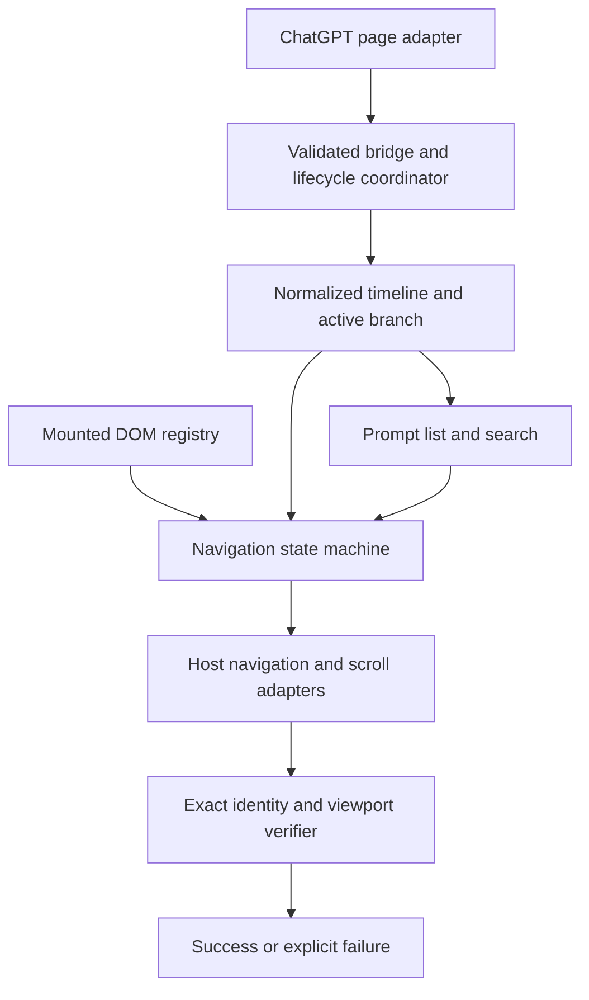

**ChatGPT Prompt Navigator: feasibility and development recommendation**

Assessment date: 8 September 2026. Scope: the supplied prompt, an empty local Git repository, three reference implementations, and current primary browser/tooling documentation. No authenticated long ChatGPT conversation was available in the DevTools browser, so this is a source-backed engineering assessment, not a live compatibility certification.

The extension is feasible as a maintained, compatibility-tested Chrome extension. The prompt has the right foundations, but its unconditional promise to reach any historical prompt is not established. Two separate things must work: obtaining every prompt on the selected conversation branch, and making ChatGPT render the requested prompt. A complete local index does not give the extension control of ChatGPT's renderer.

My recommendation is **risk-first development in small end-to-end slices, with tests from the first spike**. Prove complete acquisition and one difficult historical jump before investing in the polished sidebar. Keep the adapter boundaries in the prompt, add explicit completeness and cancellation contracts, and define failure honestly.

| Requirement | Assessment | What must be demonstrated |
|---|---|---|
| Sidebar, previews, filtering, collapse, theme support | Straightforward | Layout and keyboard behavior on supported page widths |
| Mounted-target navigation | Straightforward with correct identity | Correct scroll ancestor and visible prompt anchor |
| Full current-branch prompt list | Conditional | Complete source coverage, pagination termination, and branch selection |
| Navigation to unmounted prompts | Feasible under observed host capabilities | Ordered anchors, eventual mounting, bounded search, exact verification |
| Every prompt on every branch | Needs a separate feature | Inactive branches require host branch switching; scrolling cannot reveal them |
| Local-only operation | Feasible | No external upload, no conversation sync, bounded local data retention |
| Permanent reliability across ChatGPT changes | Cannot be guaranteed | Compatibility checks, replaceable adapters, explicit degraded states |

The statement that modern ChatGPT virtualizes conversations should be a hypothesis to test in the actual supported session. Distinguish an unmounted turn from a mounted placeholder, skipped rendering, and history that has not yet been downloaded. These require different recovery mechanisms. The references demonstrate relevant approaches, but they do not prove which rendering mode is active for this user's account today.

**The reference code validates the direction, with significant caveats.**

The original ChatGPT-Navigator replaces its message list with a DOM query, assigns timestamp-based fallback IDs, and jumps using `scrollIntoView()`. That supports the user's diagnosis. Its current source is a useful failure case for regression fixtures. [Baseline source](https://raw.githubusercontent.com/duball97/ChatGPT-Navigator/main/contentScript.js)

LunaTOC, reviewed at `1339969ec25d7c9b63068abd3776ce41780023ed`, separates page capture from its navigator and verifies message identity at the end of virtual search. Its configured search permits 32 attempts and 30 seconds: this is bounded recovery, not an instant-jump guarantee. Borrow the separation, cancellation, and exact verification. [Final verification](https://github.com/Leo7805/luna-toc/blob/1339969ec25d7c9b63068abd3776ce41780023ed/src/navigation/jump/promptNavigation.ts#L423-L504), [search configuration](https://github.com/Leo7805/luna-toc/blob/1339969ec25d7c9b63068abd3776ce41780023ed/src/config/config.ts#L186-L207)

Its history backfill stops on failures or a ten-page cap and still signals that loading ended. Its flat message handling also collapses consecutive user messages; it is not a general active-branch graph traversal. Do not inherit those behaviors as definitions of complete history or correct branch selection. [Backfill](https://github.com/Leo7805/luna-toc/blob/1339969ec25d7c9b63068abd3776ce41780023ed/src/pageHook/conversationBackfill.ts#L49-L117), [message handling](https://github.com/Leo7805/luna-toc/blob/1339969ec25d7c9b63068abd3776ce41780023ed/src/features/conversationPrompts/message.ts#L172-L213)

GPT Conversation Toolkit, reviewed at `b637ccef982703cd20486db9e9211eda9b25a1aa`, offers useful active-path normalization and multiple conversation-source strategies. Its optional private React virtualizer bridge is disabled by default. Default search can accept a weak text match, so it does not satisfy the exact repeated-prompt criterion. Borrow branch-aware normalization and staged search, while replacing fuzzy success with an identity-based verdict. [Active path](https://github.com/bujue3709/GPT-Conversation-Toolkit/blob/b637ccef982703cd20486db9e9211eda9b25a1aa/features/export-normalizer.js#L270-L311), [native gate](https://github.com/bujue3709/GPT-Conversation-Toolkit/blob/b637ccef982703cd20486db9e9211eda9b25a1aa/features/virtualized-jump.js#L1081-L1103), [weak-match success](https://github.com/bujue3709/GPT-Conversation-Toolkit/blob/b637ccef982703cd20486db9e9211eda9b25a1aa/features/virtualized-jump.js#L1186-L1240)

The Toolkit reviewer also reproduced a cache failure using an isolated harness against the unmodified source: requesting conversation B after capturing A can return A. The bridge falls back to its newest cache entry, and the consumer accepts a complete mapping without checking the requested conversation ID. This directly motivates strict identity checks on source results. [Cache fallback](https://github.com/bujue3709/GPT-Conversation-Toolkit/blob/b637ccef982703cd20486db9e9211eda9b25a1aa/features/conversation-capture-bridge.js#L120-L155), [consumer](https://github.com/bujue3709/GPT-Conversation-Toolkit/blob/b637ccef982703cd20486db9e9211eda9b25a1aa/features/conversation-api.js#L536-L540)

Prefer conceptual reuse. LunaTOC and Toolkit contain MIT license files; the baseline's file is labeled MIT but contains nonstandard/incomplete wording. Preserve and review the actual notices before copying source. [LunaTOC license](https://github.com/Leo7805/luna-toc/blob/1339969ec25d7c9b63068abd3776ce41780023ed/LICENSE), [Toolkit license](https://github.com/bujue3709/GPT-Conversation-Toolkit/blob/b637ccef982703cd20486db9e9211eda9b25a1aa/LICENSE), [baseline license](https://raw.githubusercontent.com/duball97/ChatGPT-Navigator/main/LICENSE)

**The architecture should make uncertainty explicit.**

Use four boundaries, without creating dozens of abstractions before the spike:

1. **Page adapter:** early payload and route observations in the page's MAIN world; endpoint/schema details and any native-navigation integration stay here.
2. **Domain model:** serializable conversation timeline, active-branch selection, prompt projections, provenance, completeness, and source reconciliation. No DOM objects.
3. **Content runtime:** lifecycle ownership, mounted-node registry, scroll-container detection, navigation, and verification.
4. **UI:** a small right-side panel that renders domain state and sends navigation requests.

Chrome isolates ordinary content scripts from page JavaScript. Declare the early hook explicitly in MAIN, keep the rest isolated, and validate the shared-page bridge. MAIN-world code is exposed to the host environment; origin checks or a nonce do not authenticate a message against scripts on that same page. Keep the bridge narrow and never expose generic privileged commands. [Content-script worlds](https://developer.chrome.com/docs/extensions/develop/concepts/content-scripts), [messaging security](https://developer.chrome.com/docs/extensions/develop/concepts/messaging#security-considerations)

The prompt's `PromptRecord.node` should move into a separate mounted-node registry. Keep node ID, message ID, and DOM turn ID distinct until their relationship is observed. Preserve ordering metadata for all turns, including assistant/tool turns, even though the UI lists only user prompts. This permits navigation and active-prompt tracking while the viewport contains only a long assistant answer. Retain only the assistant content evidence that measurements show is necessary.

Define the MVP as all user prompts on the **currently selected branch**. For graph payloads, follow the selected leaf through its parents and reverse the path; never infer chronology from object iteration order or timestamps alone. For flat paginated payloads, establish that the endpoint actually returns the selected branch. Unknown branch selection stays unknown. Branch changes can happen without a URL change and must invalidate affected state.

Every source result needs conversation identity, lifecycle generation, revision/branch evidence, provenance, and coverage such as `unknown | partial | complete`. Every asynchronous consumer checks that it still belongs to the current generation. A request finishing, reaching a page cap, or hitting an error does not establish completeness. DOMSource only supplies observed turns; LocalCacheSource only supplies previously observed data. Neither can manufacture missing history.

Begin acquisition with narrowly filtered observation of payloads ChatGPT already loads. Plan for cold loads, SPA transitions, already-open tabs, streaming/new prompts, and partial pages. The early bridge needs a bounded handshake/buffer so capture does not race its receiver. Passive observation can miss already-completed requests and may never see older pages; add an isolated same-origin history-fetch adapter only if the spike proves it necessary and compatible. Validate the returned conversation, deduplicate cursors, bound retries, respect server backoff, and mark incomplete coverage honestly. It can remain local-only in the intended sense of no third-party upload while still making requests to ChatGPT itself; an offline-only requirement would be different.

Chrome's `webRequest` API is not a general response-body reader. Broad network permissions do not solve payload extraction. [Chrome webRequest reference](https://developer.chrome.com/docs/extensions/reference/api/webRequest)

Avoid indiscriminately cloning every response or buffering entire assistant streams. A slow consumer of a cloned response can accumulate unbounded queued data; filter before cloning and use bounded parsing/cancellation. Return the host response without awaiting extension parsing. [Response.clone behavior](https://developer.mozilla.org/en-US/docs/Web/API/Response/clone)

Use one lifecycle coordinator for initial boot, push/replace history observations, popstate, branch changes, and host-root replacement. Page-world wrappers must preserve original behavior and be idempotent. A `popstate` listener alone misses programmatic push/replace calls. Dispose observers, invalidate node associations, and abort old work on transitions; do not wrap history again on every route. [History events](https://developer.mozilla.org/en-US/docs/Web/API/Window/popstate_event)

Keep the active jump in the content runtime. A service worker is optional for settings/actions and cannot own a DOM-dependent scrolling loop; its globals may disappear when it suspends. [MV3 worker lifecycle](https://developer.chrome.com/docs/extensions/develop/migrate/to-service-workers)

**Navigation should have a precise success contract.**

Resolve the target's branch and identity, then try a mounted match, an observed native UI capability, and finally bounded virtual search. A private React object-graph probe should remain an optional experiment, not the default dependency. Fetching more history into the extension does not necessarily load that history into ChatGPT's renderer; the navigation adapter must distinguish those two operations.

For scroll search, map mounted anchors to timeline order, bracket the target, and update the bracket after each render. Treat index/total multiplied by scroll height as an initial estimate only. Variable answer heights, placeholders, scroll anchoring, lazy loading, and late image/font layout can invalidate it. If the target falls inside the observed range but remains absent, try local refinement and re-resolution instead of arbitrarily picking a direction. Missing ordered anchors or inaccessible history can make generic search unable to converge.

Use immediate scrolling during search, mutation/resize evidence plus bounded frame settling, and re-resolve disconnected targets. Continuous streaming means waiting for all page mutations to stop can deadlock. Scope observers to the conversation root, batch work, ignore the extension UI, and avoid a whole-document rescan on every token.

A successful jump requires the current conversation/branch, the intended message identity, a connected prompt anchor, and meaningful visibility inside the effective conversation viewport after final positioning. Account for the header, composer, clipping, and layout shifts. A prompt taller than the viewport succeeds when its leading anchor is visibly positioned; requiring the entire prompt to fit is impossible. A matching text fingerprint alone is candidate evidence. Repeated identical prompts without identity or sufficient positional evidence must produce an ambiguous result.

Return structured outcomes such as `success`, `cancelled`, `ambiguous`, `source-incomplete`, `not-reachable`, `unsupported`, and `timed-out`. New clicks supersede old clicks. A route/branch change or user scroll intent aborts current navigation; programmatic scroll events must not cancel themselves. No old operation may scroll or mark success after cancellation. Cache measured anchors only while their identity/layout evidence remains valid.

For highlighting, distinguish the clicked destination from the currently viewed prompt. During a long answer, keep the preceding prompt active when supported by the mapped timeline. When evidence is missing, show an unknown state rather than an unrelated highlight.

**Use a small, conventional stack.**

I recommend **MV3 + strict TypeScript + Vite/CRXJS + vanilla TypeScript UI in Shadow DOM + Vitest + Playwright**. This fits the proposed project and keeps the difficult logic independent of a UI framework. WXT is a reasonable alternative when its lifecycle and Shadow DOM helpers are valuable to the team; switching frameworks will not resolve acquisition or navigation uncertainty. [WXT content utilities](https://wxt.dev/guide/essentials/content-scripts.html)

CRXJS specifically warns that its ordinary asynchronous content-script loader can be too late for early API interception. Use its standalone `pageHook.iife.ts` entry, declared with `world: MAIN` and `run_at: document_start`. Reload the page when that hook changes, and inspect the production bundle's timing; successful HMR is insufficient evidence. [CRXJS content-script guidance](https://crxjs.dev/concepts/content/)

Use an injected panel for the requested persistent right-side experience, with accessible controls and a collapse mode on narrow windows. Shadow DOM provides style isolation, not a security boundary. Native Chrome sidePanel is an alternative product decision: programmatic opening requires a user gesture, so it is not equivalent to an automatically visible in-page panel. [Chrome sidePanel behavior](https://developer.chrome.com/docs/extensions/reference/api/sidePanel)

Start with matching content scripts on `https://chatgpt.com/*`; add other hosts only when supported and tested. Use `storage` only if settings/persistence require it. Avoid adding broad host access, cookies, debugger, webRequest, or dynamic scripting permissions without a demonstrated need. Keep prompts in tab memory by default. Optional persistent caches should store only needed text/metadata, have size/age limits and deletion controls, and be scoped or cleared across accounts. Never put conversation content in `storage.sync`, which can upload it through Chrome Sync. [Chrome storage semantics](https://developer.chrome.com/docs/extensions/reference/api/storage)

**Replace the seven sequential feature phases with these gates.**

| Stage | Deliverable | Exit gate |
|---|---|---|
| 0. Compatibility spike | Minimal real MV3 probe and sanitized evidence from a current long chat | Establish source coverage/branch semantics; prove bottom-to-oldest and return jump when the target starts unmounted; document unsupported cases |
| 1. Walking skeleton | One complete path: captured data → index → tiny list → verified jump | Built extension works on a synthetic virtualized fixture and a controlled live conversation |
| 2. Data correctness | Graph/flat adapters, completeness states, streaming/provisional reconciliation, route/branch lifecycle | No missing/duplicate active-branch prompts in fixtures; no stale or cross-conversation results |
| 3. Navigation reliability | Cancellation, bounded search, remount recovery, final verifier | No wrong-target successes across adversarial browser fixtures; explicit terminal failures |
| 4. Product UX | Search, current highlight, theme, collapse, keyboard/accessibility | Interaction and layout checks pass without interfering with ChatGPT input/scrolling |
| 5. Release hardening | Minimal-permission production package and compatibility notes | Full fixture suite plus live smoke checks on declared supported routes/layouts |

These are development gates, not a reason to stop after every routine step for permission. Continue when a gate passes; revisit scope or strategy if the core feasibility gate fails. A practical initial spike timebox is 1–3 engineering days, an estimate rather than a promise. Do not provide a credible full-project schedule until the live source/navigation mechanism is known.

Each implementation slice should include a short decision note, the smallest relevant code change, a regression fixture for any observed failure, and checks for the built extension. Pin dependencies and reference SHAs. Keep site selectors, payload formats, route patterns, and native capabilities in a compact compatibility layer so a ChatGPT change can be repaired without rewriting the domain model.

**Testing starts before the full UI.**

Use Vitest for graph traversal, payload normalization, completeness, source reconciliation, identity matching, and navigation decisions with fake adapters. jsdom cannot establish real layout, virtualizer behavior, or successful scrolling.

Build a local fixture app with an independently known timeline that mounts a moving window of turns. Include fully mounted, placeholder, render-skipped, virtualized, and paginated modes; uneven heights; missing anchors; repeated text; delayed layout changes; unsupported native navigation; and cursor failures. The test oracle must know the intended ID independently of the extension's resolver.

Load the built MV3 extension in Playwright using a disposable persistent context and bundled Chromium. Exercise actual MAIN/isolated scripts and their bridge; do not substitute direct calls into internal application functions. Playwright documents the persistent-context requirement and recommends its bundled Chromium because branded Chrome/Edge removed the relevant sideloading flags. A test-only localhost match may be used for fixtures, but verify the release manifest contains no test hosts and still perform actual-host checks. [Playwright extension testing](https://playwright.dev/docs/chrome-extensions)

| Test group | Cases and required assertions |
|---|---|
| Scale and distance | 10, 50, 200, 500 user prompts; bottom→first, first→last, repeated distant jumps; uneven assistant lengths |
| Identity and branching | Identical prompt text, edits/regenerations, missing selected leaf, ID aliases, attachment-only prompts; ambiguous matches never succeed |
| Rendering | Initially absent targets, recycled nodes, empty windows, huge responses, sticky UI, zoom/resize and delayed images |
| Lifecycle | Route switch and same-URL branch change mid-jump, new conversation gets an ID, new click, user interruption, host-root replacement |
| Acquisition | Cold load, cached route, missed initial payload, streaming/new prompt, partial pages, repeated cursor, 401/429, malformed schema |
| Isolation and packaging | Bridge payload validation, no raw prompt HTML, production hook timing, no test hosts, no external conversation transmission |

For release, require zero wrong-target successes in the test corpus, exact expected prompt coverage for complete fixtures, explicit partial/unsupported states, no post-cancellation side effects, and bounded work. Record success rate, p50/p95 jump time, attempts, and failure reasons by rendering mode. Choose latency budgets after the spike and reference hardware; do not turn LunaTOC's 30-second timeout into the product target. Passing a finite suite supports a scoped reliability claim, not universal future compatibility.

Real-site smoke checks remain necessary because fixtures cannot prove compatibility with undocumented host behavior. Use controlled test conversations, avoid committing private payloads, and keep diagnostic traces local and free of raw conversation content by default. The present assessment did not run those smoke checks or build an extension. The immediate next implementation milestone is the compatibility spike described above.
